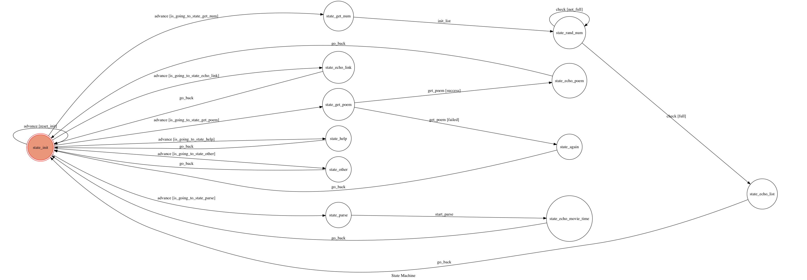

# TOC Project 2017

## Setup

### Prerequisite
* Python 3

#### Install Dependency
```sh
pip install -r requirements.txt
```

* pygraphviz (For visualizing Finite State Machine)

### Run Locally
In this program, I use ngrok and setting is

```sh
ngrok http 5000
```

#### Run the sever

```sh
python3 app.py
```

## Finite State Machine


## Interact

* user
    * Input : "/start" : reset the chat bot and chat bot will reply welcome message
    * Input : "求籤"    : chat bot will help you get a poem from 60 poems and test whether the poem is suit for user.
                         if the poem is suit for user and chat bot will reply a website which is the meaning of that poem
                         if the poem isn't suit for user, chat bot will ask you to input "求籤" again to ask the poem again.
    * Input : "大樂透"  : chatbot will random 6 different numbers into a list, reply to user after sort
    * Input : "威秀"    : chatbot will parse the showtime of vieshow and reply to user a movie/message and reply an "End" after end of parser
    * Input : "Hi"     : chatbot will send a wonderful link of a picture to say hello to user.
    * Input : "/help"  : list out all of the functions of this chat bot
    * Input : none of above
                       : chatbot will say itself has not that kind of funtion and remind you to input "/help" to get instruction of input

## Author
[klin0816](https://github.com/klin0816)
